<h1>Site Name : VirtualShop.com</h1>

<h2>It is an e-commerce website where you can buy products related fashion, mobile and speakers etc.</h2>

<h1>Tech Stack Used :- </h1>

<h2>Frontend : </h2>
  <h3>React</h3>
  <h3>HTML</h3>
  <h3>CSS</h3>
  <h3>JavaScript</h3>
  <h3>Redux</h3>
  <h3>Chakra UI</h3>
  <h3>react-bootstrap</h3>

<h2>Backend is Deployed at : <b>glitch.com</b></h2>
<i>Backend URL : https://lackadaisical-volcano-larch.glitch.me/</i>
  
<h1>This is the Home Page of the website</h1>

<h2>As you can see in the Navbar there is <b>Sign In</b> text and as soon as you login this text will change to the Name of the person that has logged In.</h2>

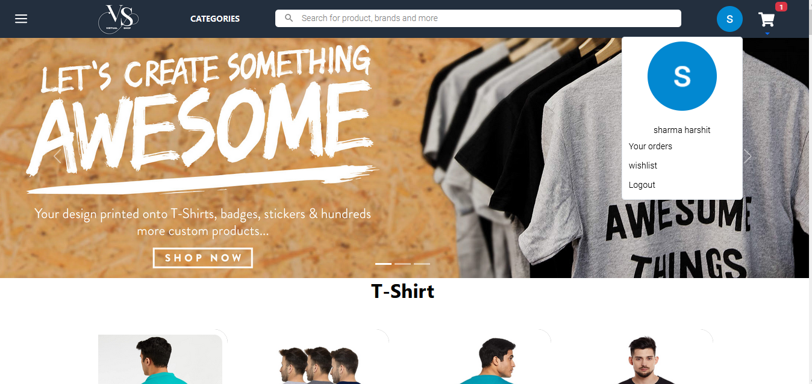

<h2>As you can see in the Navbar there is <b>Categories</b> button and as soon as you click on it. A drop down will show where you can find different category of products</h2>

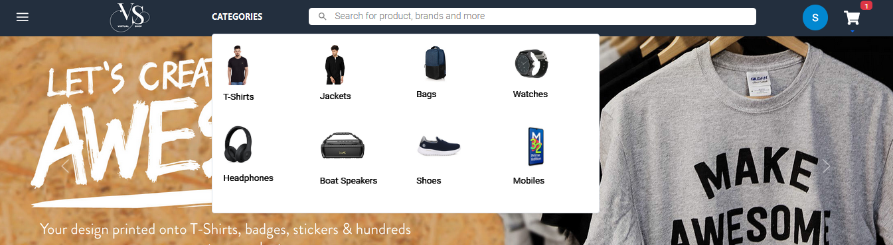

<h2>And if you click on the cart icon which was there on the navbar, you can see various products present in your cart.</h2>

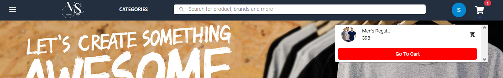

<h2>And Below you can see the various Products listed on Home Page.</h2>

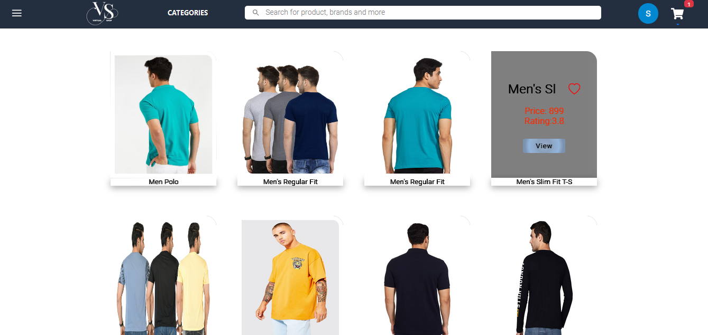

<h2>And this is the Footer of this website </h2>

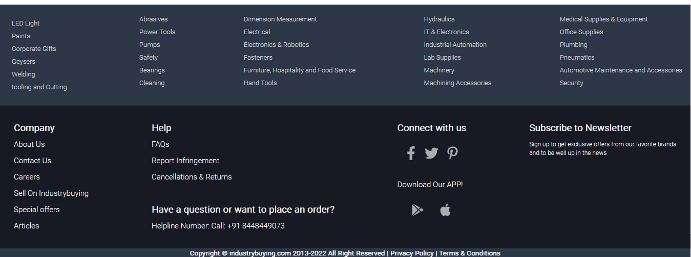

<h2>And If you click on any of the products of homepage then you will be redirected to the particular page which will show you that particular product and its detailed description,like you can see in the below image:</h2>

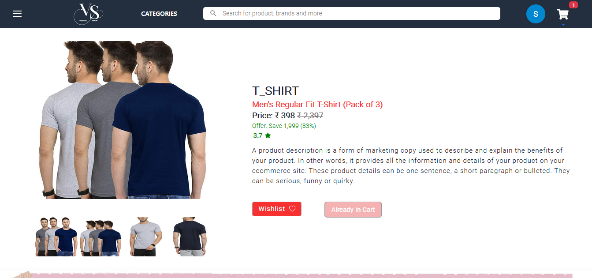

<h2>As you can see there is button with text "Add to Cart" and if you click on this button then this text will change to "Alreadt Added" and this button will get disabled and also that particular Product will get added to the cart </h2>

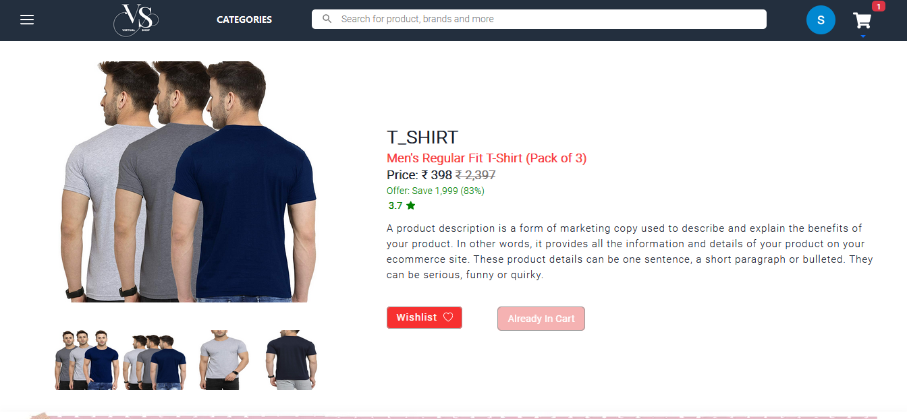

<h2>Now if you want to go the Cart Page then you just click on the cart Icon on the Navbar and then you will be redirected to the cart page</h2>

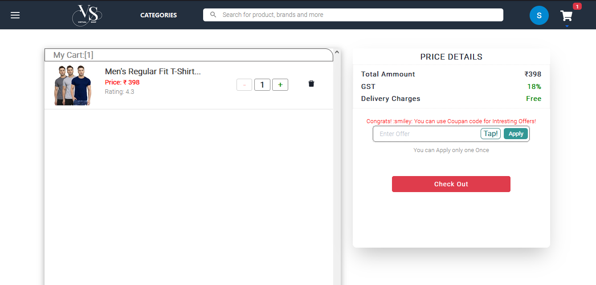

<h2>Now you can see all the products you have added to the cart and If you want to remove any item you can click on remove icon and that particular item will get removed and then if you click on checkout button you will be checked out from cart page and will be redirected to the Delivery address page.</h2>

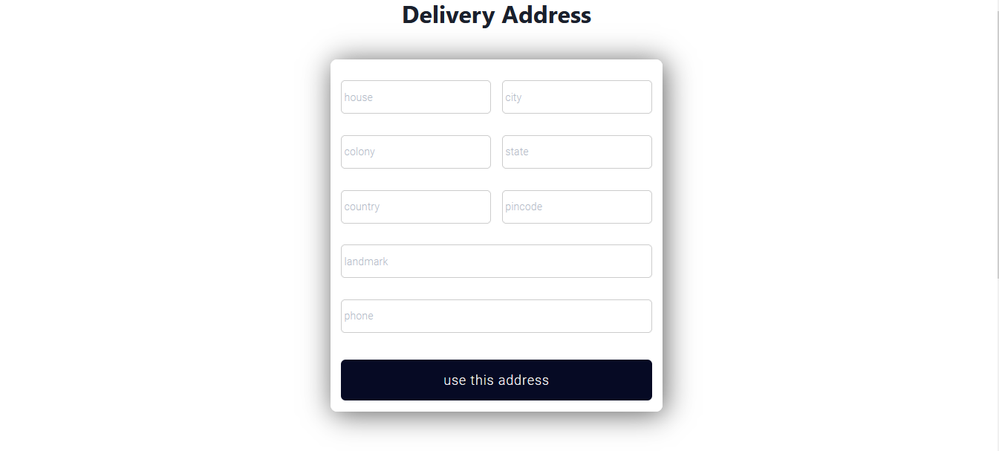

<h2>And now after filling the delivery address it will ask for the card details.</h2>

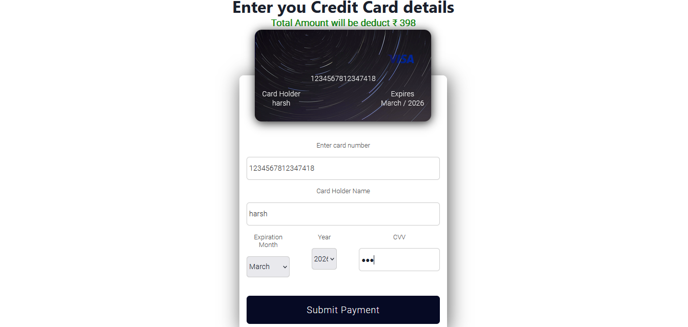

<h2>After filling all the card details and clicking on submit payment. It will show a message that payment successfull and you can see the orders on clicking the see orders button.</h2>

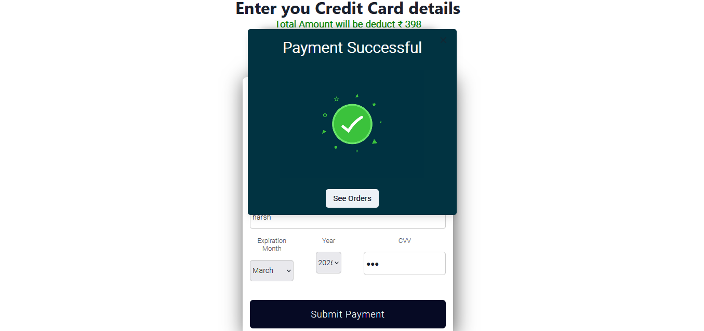

<h2>This is the order page and now you can click on home icon or the website logo on the navbar to go to the homepage.</h2>

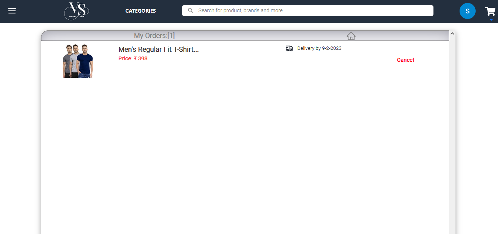
